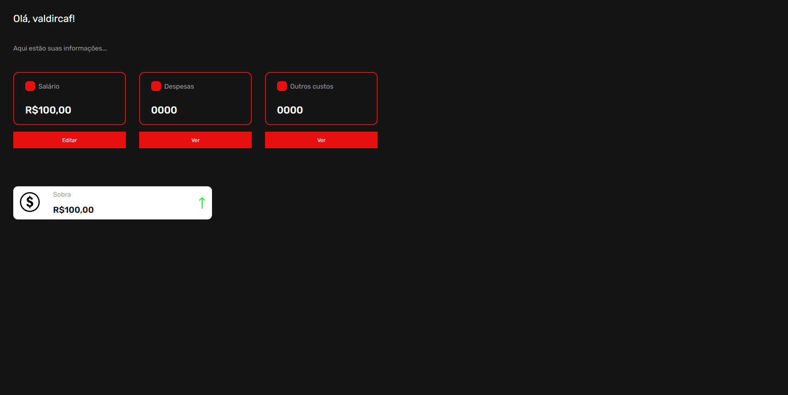

# 💸 Finances



# ⁉️ Sobre o projeto

Finances é um aplicativo desenvolvido para suprir uma necessidade própria, onde eu já havia procurado aplicativos para este fim, porém não havia encontrado.

No aplicativo, o usuário pode fazer o cadastro, e depois logar na sua conta cadastrada sendo redirecionado para o dashboard. Após isso, pode ser inserido um salário, despesas mensais e despesas não mensais. O aplicativo deixa registrado todas as informações para o usuário, e informa se o balanço final do usuário está positivo ou negativo.

# 🛠️ Tecnologias 
## Back end
- Java
- Spring Boot
- JPA / Hibernate
- Maven
## Front end
- HTML / SCSS / JS 
- ReactJS
## Implantação em produção
- Back end: Render
- Front end web: Vercel
- Banco de dados: Railway

# Como executar o projeto

## Front end web
Pré-requisitos: npm 

```bash
# clonar repositório
git clone git@github.com:valdircaf/Finances.git

# instalar dependências e sass
npm install
npm install sass

# executar o projeto
npm run dev
```

# Autor

Valdir Castro

https://www.linkedin.com/in/valdir-castro10

## License
[](https://github.com/valdircaf/Finances/blob/main/LICENSE) 

## Link
Este projeto está disponível no link abaixo:
[Acessar site](https://finances-kappa-mocha.vercel.app/)

